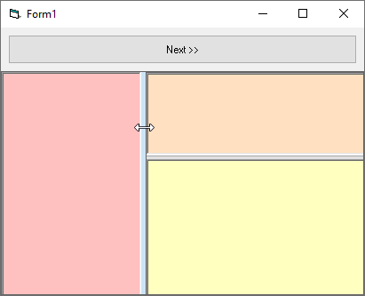

# Ctrl_Splitter
## Splitter Control horizontal or vertical
in fact it is just a Class not a Control, nothing more is needed here.  
Project started in dec. 1999, first stable version in sept.2005
On the form an extra CommandButton will be created as Splitter, it looks cool, dunno why nobody else got the idea, but see yourself.  

